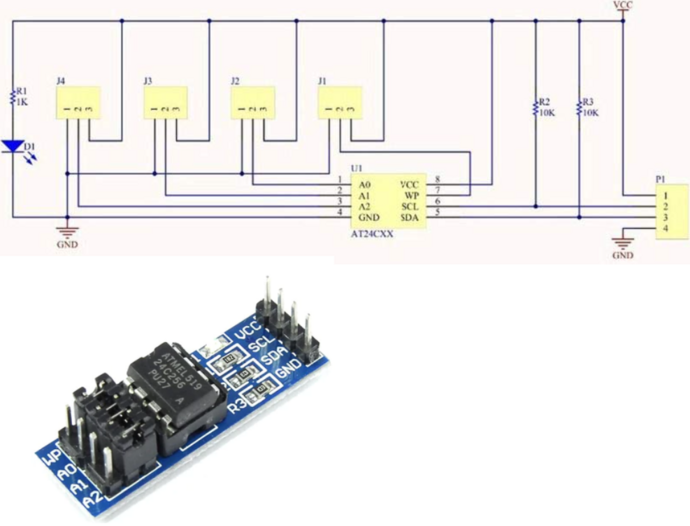

+++
weight = 2
title = 'AT24C256 EEPROM'
+++


# AT24C256 I2C EEPROM board



The infamous cheap AT24C256 I2C EEPROM board provides 32K bytes of storage for your projects:

- Cost: ~$2
- Size: 32768 bytes
- VCC: 2.7 - 5.5V
- It includes I2C pull-ups
- Speeds: 1 MHz (5V), 400 kHz (2.7V, 2.5V)
- 64-byte Page Write Mode (Partial Page Writes Allowed). 
- I2C address ranges from 0x50 to 0x57 and can be configured using the A jumpers (A0-A2)


{}

## Connections

|Bus Pirate|AT24C256 board|Description|
|-|-|-|
|SDA|SDA|I2C Data|
|SCL|SCL|I2C Clock|
|Vout/Vref|VCC|5volt power supply|
|GND|GND|Ground|

## Setup

Considering:
- AT24C256's datasheet max speed
- AT24C256 board pull-ups are 10k
- You've purchased a low-quality clone from AliExpress or any other source
- The length of the Bus pirate cable

We're going to be very conservative and operate at:
- 5V, 100kHz.
- Max current: 50ma.

{}
Since the AT24C256 board already includes pull-ups, there's no need to utilize the pull-ups from the Bus Pirate. If you're using the chip alone (socket adapter, breadboard...) you must activate the Bus Pirate's pull-ups (using the 'P' command) and also connect WP, A0, A1, and A2 to GND.
{}

{}
<span style="color:#96cb59">HiZ></span> m

<span style="color:#bfa530">Mode selection</span>
 1. <span style="color:#bfa530">HiZ</span>
 2. <span style="color:#bfa530">1-WIRE</span>
 3. <span style="color:#bfa530">UART</span>
 4. <span style="color:#bfa530">I2C</span>
 5. <span style="color:#bfa530">SPI</span>
 6. <span style="color:#bfa530">LED</span>
 x. <span style="color:#bfa530">Exit</span>
<span style="color:#96cb59">Mode ></span> 4
<span style="color:#bfa530">I2C speed</span>
 1KHz to 1000KHz
 x. <span style="color:#bfa530">Exit</span>
<span style="color:#96cb59">KHz (</span>400KHz*<span style="color:#96cb59">) ></span> 100
<span style="color:#bfa530">Data bits</span>
 1. <span style="color:#bfa530">8*</span>
 2. <span style="color:#bfa530">10</span>
 x. <span style="color:#bfa530">Exit</span>
<span style="color:#96cb59">Bits (</span>1<span style="color:#96cb59">) ></span> 
<span style="color:#bfa530">Mode:</span> I2C
<span style="color:#96cb59">I2C></span> W
<span style="color:#bfa530">Power supply
Volts (0.80V-5.00V)</span>
<span style="color:#96cb59">x to exit (3.30) ></span> 5
<span style="color:#53a6e6">5.00</span>V<span style="color:#bfa530"> requested, closest value: <span style="color:#53a6e6">5.00</span></span>V
Set current limit?
y

<span style="color:#bfa530">Maximum current (0mA-500mA)</span>
<span style="color:#96cb59">x to exit (100.00) ></span> 50
<span style="color:#53a6e6">50.0</span>mA<span style="color:#bfa530"> requested, closest value: <span style="color:#53a6e6">50.0</span></span>mA

<span style="color:#bfa530">Power supply:</span>Enabled
<span style="color:#bfa530">
Vreg output: <span style="color:#53a6e6">4.9</span></span>V<span style="color:#bfa530">, Vref/Vout pin: <span style="color:#53a6e6">4.9</span></span>V<span style="color:#bfa530">, Current sense: <span style="color:#53a6e6">9.2</span></span>mA<span style="color:#bfa530">
</span>
<span style="color:#96cb59">I2C></span> 

{}

- Use the ```m``` mode command and select **I2C**
- Configure I2C for **100kHz** and **8bits** of data
- Enable the onboard power supply with the ```W``` command, and configure it for **5volts** output. 
- Select a current limit of at least **50mA**.

## Partial write

We'll write three bytes - 0x41, 0x42, 0x43 - to the EEPROM at memory location 0x69.

{}
<span style="color:#96cb59">I2C></span> [0xA0 0x00 0x69 0x41 0x42 0x43]

I2C START
<span style="color:#bfa530">TX:</span> 0x<span style="color:#53a6e6">A0</span> ACK 0x<span style="color:#53a6e6">00</span> ACK 0x<span style="color:#53a6e6">69</span> ACK 0x<span style="color:#53a6e6">41</span> ACK 0x<span style="color:#53a6e6">42</span> ACK 0x<span style="color:#53a6e6">43</span> ACK 
I2C STOP
<span style="color:#96cb59">I2C></span> 
{}

- ```[``` Begin with an I2C START
- ```0xA0``` is the I2C device address.
- ```0x00 0x69``` is the memory address where we intend to write. The AT24C256 has a 16bit/2byte address range. 
- ```0x41 0x42 0x43``` are the three data bytes we want to write.
- ```]``` End with an I2C STOP

{}
After initiating a data write to the EEPROM, you must wait up to 5ms to ensure that the write cycle is complete before starting another. If you enter the write and read commands on separate lines there will be plenty of delay for the write to complete, but if you enter it on a single line be sure to add a 5ms delay between the commands with ```D:5```.
{}

{}
If the writing process fails, check all connections. A0, A1, A2 jumpers must be connected to GND, and ensure that the WP jumper is also connected to GND.
{}

### Reading three bytes

We'll read three bytes from the EEPROM at memory location 0x69. To achieve this, two commands are necessary.

{}
<span style="color:#96cb59">I2C></span> [0xA0 0x00 0x69]

I2C START
<span style="color:#bfa530">TX:</span> 0x<span style="color:#53a6e6">A0</span> ACK 0x<span style="color:#53a6e6">00</span> ACK 0x<span style="color:#53a6e6">69</span> ACK 
I2C STOP
<span style="color:#96cb59">I2C></span> 
{}

First, use a write command with no data to to indicate the memory address we want to read.
- ```[``` Begin with an I2C START
- ```0xA0``` is the I2C device write address.
- ```0x00 0x69``` is the 16bit/2byte memory address to read.
- ```]``` End with an I2C STOP

{}
<span style="color:#96cb59">I2C></span> [0xA1 r:3]

I2C START
<span style="color:#bfa530">TX:</span> 0x<span style="color:#53a6e6">A1</span> ACK 
<span style="color:#bfa530">RX:</span> 0x<span style="color:#53a6e6">41</span> ACK 0x<span style="color:#53a6e6">42</span> ACK 0x<span style="color:#53a6e6">43</span> NACK 
I2C STOP
<span style="color:#96cb59">I2C></span> 
{}

Second, use the I2C read address to read the bytes from that memory location.
- ```[``` Begin with an I2C START
- ```0xA1``` is the I2C device read address to access data at the location we set with the previous command.
- ```r:3``` reads back three bytes of data. Bytes read: 0x41 0x42 0x43.
- ```]``` End with an I2C STOP

{}
If the reading process fails, check all connections. A0, A1, A2 jumpers must be connected to GND.
{}

## Get a Bus Pirate


{}

### Community


{}
