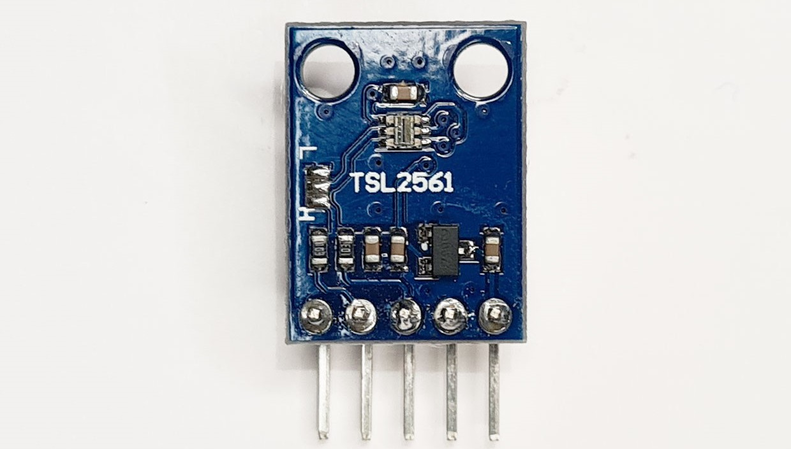
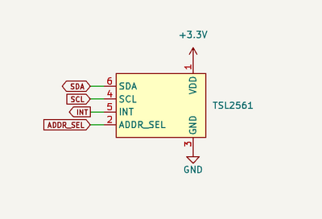
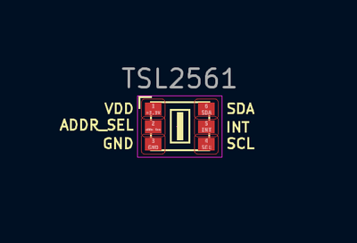

+++
weight = 2
title = 'TSL2561 LUX'
+++


# TSL2561 Light Sensor



TSL2561 is a light sensor that measures visible and infrared light. It's used in mobile phones, laptops, and other devices to adjust screen brightness. It's also used in street lights to adjust brightness based on ambient light levels.


{}

## Connections

 

|Bus Pirate|TL2561|Description|
|-|-|-|
|SDA|SDA|I2C Data|
|SCL|SCL|I2C Clock|
|Vout/Vref|VDD|3.3volt power supply|
|GND|GND|Ground|

### Device address

|ADDR SEL (Pin 2)|Address|
|---|---|
|GND|0101001x|
|Float|0111001x|
|VDD|01001001x|

Pin 2 (ADDR SEL) determines the I2C address of the TL2561. The default address is 0x39 (111001).  The address can be changed by connecting the ADDR SEL pin to VDD or GND. 

{}
If you're using a breakout board without a datasheet, you can use the Bus Pirate I2C address search marco ```(1)``` to find the device.
{}

## Setup

{}
<span style="color:#96cb59">HiZ></span> m

<span style="color:#bfa530">Mode selection</span>
 1. <span style="color:#bfa530">HiZ</span>
 2. <span style="color:#bfa530">1-WIRE</span>
 3. <span style="color:#bfa530">UART</span>
 4. <span style="color:#bfa530">I2C</span>
 5. <span style="color:#bfa530">SPI</span>
 6. <span style="color:#bfa530">LED</span>
 x. <span style="color:#bfa530">Exit</span>
<span style="color:#96cb59">Mode ></span> 4

<span style="color:#bfa530">I2C speed</span>
 1KHz to 1000KHz
 x. <span style="color:#bfa530">Exit</span>
<span style="color:#96cb59">KHz (</span>400KHz*<span style="color:#96cb59">) ></span> 
<span style="color:#bfa530">Data bits</span>
 1. <span style="color:#bfa530">8*</span>
 2. <span style="color:#bfa530">10</span>
 x. <span style="color:#bfa530">Exit</span>
<span style="color:#96cb59">Bits (</span>1<span style="color:#96cb59">) ></span> 
<span style="color:#bfa530">Mode:</span> I2C
<span style="color:#96cb59">I2C></span> W
<span style="color:#bfa530">Power supply
Volts (0.80V-5.00V)</span>
<span style="color:#96cb59">x to exit (3.30) ></span> 
<span style="color:#53a6e6">3.30</span>V<span style="color:#bfa530"> requested, closest value: <span style="color:#53a6e6">3.30</span></span>V
Set current limit?
n

<span style="color:#bfa530">Power supply:</span>Enabled
<span style="color:#bfa530">
Vreg output: <span style="color:#53a6e6">3.3</span></span>V<span style="color:#bfa530">, Vref/Vout pin: <span style="color:#53a6e6">3.3</span></span>V<span style="color:#bfa530">, Current sense: <span style="color:#53a6e6">4.3</span></span>mA<span style="color:#bfa530">
</span>
<span style="color:#96cb59">I2C></span> P
<span style="color:#bfa530">Pull-up resistors:</span> Enabled (10K ohms @ <span style="color:#53a6e6">3.3</span>V)
<span style="color:#96cb59">I2C></span> 
{}

- Use the ```m``` mode command and select **I2C**
- Configure I2C for **400kHz** and **8bits** of data
- Enable the onboard power supply with the ```W``` command, and configure it for **3.3volts** output. Optionally select a current limit of at least **50mA**.
- Enable the onboard pull-up resistors with the ```P``` command.

## Register map

| Address | Name | Function |
|---------|---------------|-------------------|
| --      | COMMAND       | Points to the register to read and write (0x00-0x0F) |
| 0x00     | CONTROL       | Control options |
| 0x01	 | TIMING        | Gain and integration time |
| 0x0A      | ID            | Part number and revision |
| 0x0C      | DATA0LOW      | Low byte of ADC channel 0 |
| 0x0D      | DATA0HIGH     | High byte of ADC channel 0 |
| 0x0E      | DATA1LOW      | Low byte of ADC channel 1 |
| 0x0F      | DATA1HIGH     | High byte of ADC channel 1 |

This is a partial register map showing the addresses we'll need to configure and control the TSL2561. 

| bit 7 | bit 6 | bit 5 | bit 4 | bit 3 | bit 2 | bit 1 | bit 0 |
|-------|-------|-------|-------|-------|-------|-------|-------|
| CMD |CLEAR | WORD|BLOCK| ADDR[3]| ADDR[2]| ADDR[1]| ADDR[0]|

The address written to the command register points to the register for the next read/write. 
- The command register is accessed by setting bit 7 (CMD) of the command to 1.
- Because bit 7 controls access to the command register, bit 7 is always 0 for any other commands written to other registers.
- The lower four bits of the command register are the address of the register to read or write.
- For the sake of brevity, CLEAR and WORD are set to 1, and BLOCK is set to 0.

## Start device

| bit 7 | bit 6 | bit 5 | bit 4 | bit 3 | bit 2 | bit 1 | bit 0 |
|-------|-------|-------|-------|-------|-------|-------|-------|
|-|-|-|-|-|-|Power1|Power0|

TSL2561 starts in power down mode. To start the device, write 0x03 (0b11) to the control register.

### Select CONTROL register
{}
<span style="color:#96cb59">I2C></span> [0b01110010 0b11100000]

I2C START
<span style="color:#bfa530">TX:</span> 0b<span style="color:#53a6e6">0111</span>0010 ACK 0b<span style="color:#53a6e6">1110</span>0000 ACK 
I2C STOP
<span style="color:#96cb59">I2C></span> 
{}

First, we need to write the address we wish to access to the command register. 

- ```[``` Begin with an I2C START
- ```0b01110010``` I2C write address for the TSL2651 (ADDR pin floating)
- ```0b11100000``` Write command register. Bit 7 set to 1, control register address (0x00/0b000) set in bits 3:0
- ```]``` End with an I2C STOP

### Start command

{}
<span style="color:#96cb59">I2C></span> [0b01110010 3]

I2C START
<span style="color:#bfa530">TX:</span> 0b<span style="color:#53a6e6">0111</span>0010 ACK 
<span style="color:#bfa530">TX:</span> 3 ACK 
I2C STOP
<span style="color:#96cb59">I2C></span> 
{}

Next, we write 0x03 to the control register to start the device. The control register is already selected, so we only need to write the value 0x03. 

- ```[``` Begin with an I2C START
- ```0b01110010``` I2C write address for the TSL2651 (ADDR pin floating)
- ```3``` Write 0x03 to the control register
- ```]``` End with an I2C STOP

### Confirm start

{}
<span style="color:#96cb59">I2C></span> [0b01110011 r]

I2C START
<span style="color:#bfa530">TX:</span> 0b<span style="color:#53a6e6">0111</span>0011 ACK 
<span style="color:#bfa530">RX:</span> 0x<span style="color:#53a6e6">33</span> NACK 
I2C STOP
<span style="color:#96cb59">I2C></span> 
{}

Finally, we read the control register to confirm the device is running. The control register is already selected, so we only need to read the value.

- ```[``` Begin with an I2C START
- ```0b01110011``` I2C read address for the TSL2651 (ADDR pin floating)
- ```r``` Read the control register
- ```]``` End with an I2C STOP

The control register value is 0x33, the lower 2 bits are high (0x03) indicating the device is running.

## Configure gain and integration time

| bit 7 | bit 6 | bit 5 | bit 4 | bit 3 | bit 2 | bit 1 | bit 0 |
|-------|-------|-------|-------|-------|-------|-------|-------|
| -- 	| -- 	| -- 	| GAIN  |	 -- |  --	| INTEG1 | INTEG0 |

The timing register configures the gain and integration time.
- Gain is 1x (0) or 16x (1). 16x gain helps measure in very low light levels. The default is 1x (0).
- Integration time (INTEG1:0) sets how long the sensor collects light measurements. 13.7ms (00), 101ms (01), 402ms (10). Shorter integration times help measure in very high light levels. The default is 402ms (10).

{}
We're going to use the default values. You can skip the configuration step if you like.
{}

### Select TIMING register

{}
<span style="color:#96cb59">I2C></span> [ 0b01110010 0b11100001]

I2C START
<span style="color:#bfa530">TX:</span> 0b<span style="color:#53a6e6">0111</span>0010 ACK 0b<span style="color:#53a6e6">1110</span>0001 ACK 
I2C STOP
<span style="color:#96cb59">I2C></span> 
{}

Like the control register, first we set the command register to point at the timing register (0x01). 
- ```[``` Begin with an I2C START
- ```0b01110010``` I2C write address for the TSL2651 (ADDR pin floating)
- ```0b11100001``` Write command register. Bit 7 set to 1, timing register address (0x01/0b001) set in bits 3:0
- ```]``` End with an I2C STOP

### Write TIMING register

{}
<span style="color:#96cb59">I2C></span> [0b01110010 0b00000010]

I2C START
<span style="color:#bfa530">TX:</span> 0b<span style="color:#53a6e6">0111</span>0010 ACK 0b<span style="color:#53a6e6">0000</span>0010 ACK 
I2C STOP
<span style="color:#96cb59">I2C></span> 
{}

Now configure the gain and integration time. Gain (bit 4): set to 0 (1x). Integration time (bits 1:0): set to 10 (402ms).

- ```[``` Begin with an I2C START
- ```0b01110010``` I2C write address for the TSL2651 (ADDR pin floating)
- ```0b00000010``` Write timing register. Bit 7 set to 0, gain (bit 4) set to 0, integration time (bits 1:0) set to 10
- ```]``` End with an I2C STOP

## Measure light

Once started the TSL2561 takes continuous light measurements with an ADC and stores them in the DATA0 and DATA1 registers. 

TSL2561 has two light sensors. One measures all light, the other measures infrared light only. The infrared value is used to compensate for light that isn't visible to the human eye. 

### Select DATA0LOW register

{}
<span style="color:#96cb59">I2C></span> [0b01110010 0b11101100]

I2C START
<span style="color:#bfa530">TX:</span> 0b<span style="color:#53a6e6">0111</span>0010 ACK 0b<span style="color:#53a6e6">1110</span>1100 ACK 
I2C STOP
<span style="color:#96cb59">I2C></span> 
{}

First, use the command register to select the DATA0LOW register (0x0C/0b1100) with bit 7 set to 1.
- ```[``` Begin with an I2C START
- ```0b01110010``` I2C write address for the TSL2651 (ADDR pin floating)
- ```0b11101100``` Write command register. Bit 7 set to 1, DATA0LOW register address (0x0C/0b1100) in bits 3:0
- ```]``` End with an I2C STOP

### Read DATA registers
{}
<span style="color:#96cb59">I2C></span> [0b01110011 r:4]

I2C START
<span style="color:#bfa530">TX:</span> 0b<span style="color:#53a6e6">0111</span>0011 ACK 
<span style="color:#bfa530">RX:</span> 0x<span style="color:#53a6e6">43</span> ACK 0x<span style="color:#53a6e6">00</span> ACK 0x<span style="color:#53a6e6">0C</span> ACK 0x<span style="color:#53a6e6">00</span> NACK 
I2C STOP
<span style="color:#96cb59">I2C></span> 
{}

We've arrived! It's time to read out the light sensor measurements. Each sensor measurement has a low and high byte, so we'll need to read 4 bytes (2 sensors, 2 bytes each).

- ```[``` Begin with an I2C START
- ```0b01110011``` I2C read address for the TSL2651 (ADDR pin floating)
- ```r:4``` Read 4 bytes
- ```]``` End with an I2C STOP

The data is read low byte first, followed by the high byte. Here, the measurements are 0x0043 and 0x000C.

### Convert to LUX

{}
<span style="color:#96cb59">I2C></span> = 0x0043
 =0x43 =67 =0b01000011= 'C'
<span style="color:#96cb59">I2C></span> 
{}

- Use the ```=``` convert number format command to find the decimal equivalent of 0x0043 (channel 0) and 0x0000C (channel 1) for easier calculation (67/12).

> 	ratio=chan1/chan0
	ratio=12/67
	ratio=0.1791044776

LUX is calculated by finding the ratio of the two channels, then using the ratio to select the correct formula.

| Ratio Range | Calculation |
|-------------|-----------------------|
| \<= 0.125    | Lux/(Chan0\*16) = 0.0304 - 0.0272*(ratio) |
| \<= 0.250    | Lux/(Chan0\*16) = 0.0325 - 0.0440*(ratio) |
| \<= 0.375    | Lux/(Chan0\*16) = 0.0351 - 0.0544*(ratio) |
| \<= 0.50     | Lux/(Chan0\*16) = 0.0381 - 0.0624*(ratio) |
| \<= 0.61     | Lux/(Chan0\*16) = 0.0224 - 0.031*(ratio) |
| \<= 0.80     | Lux/(Chan0\*16) = 0.0128 - 0.0153*(ratio) |
| \<= 1.30     | Lux/(Chan0\*16) = 0.00146 - 0.00112*(ratio) |
| > 1.30      | Lux/(Chan0\*16) = 0 |

Our ratio is greater than 0.125 and less than 0.250, so we'll use the second formula.

{}
By default the TSL2561 gain is set to 1. For this calculation we need to multiply the channel0 value by 16 to compensate for the gain. If the gain is set to 16, the channel0 value is multiplied by 1.
{}

> 	lux/(chan0*16)=0.0325-0.0440*(ratio)
	lux/67*16=0.0325-0.0440*(0.1791044776)
	lux/1072=0.0325-0.0078801987
	lux/1072=0.0246198013
	lux=0.0246198013*1072
	lux=26.38

The compensated LUX value is 26.38.

There's lots of other goodies in the TSL2561. High and low levels of light can trigger an interrupt on the INT pin. Gain and sensing time (integration time) can be configured to get accurate readings in different light levels. This walk through gets you started, but there's lots more to explore in the datasheet.

## Read version

The ID register contains the part number and revision of the TSL2561.

### Select ID register

{}
<span style="color:#96cb59">I2C></span> [0b01110010 0b11101010]

I2C START
<span style="color:#bfa530">TX:</span> 0b<span style="color:#53a6e6">0111</span>0010 ACK 0b<span style="color:#53a6e6">1110</span>1010 ACK 
I2C STOP
{}

First, use the command register to select the ID register (0x0A/0b1010) with bit 7 set to 1.
- ```[``` Begin with an I2C START
- ```0b01110010``` I2C write address for the TSL2651 (ADDR pin floating)
- ```0b11101010``` Write command register. Bit 7 set to 1, ID register address (0x0A/0b1010) in bits 3:0
- ```]``` End with an I2C STOP

### Read ID register

{}
<span style="color:#96cb59">I2C></span> [0b01110011 r]

I2C START
<span style="color:#bfa530">TX:</span> 0b<span style="color:#53a6e6">0111</span>0011 ACK 
<span style="color:#bfa530">RX:</span> 0x<span style="color:#53a6e6">50</span> NACK 
I2C STOP
<span style="color:#96cb59">I2C></span> = 0x50
 =0x<span style="color:#53a6e6">50</span> =80 =0b<span style="color:#53a6e6">0101</span>0000= 'P' 
<span style="color:#96cb59">I2C></span> 
{}

Now read back the device ID and revision.
- ```[``` Begin with an I2C START
- ```0b01110011``` I2C read address for the TSL2651 (ADDR pin floating)
- ```r``` Read the ID register
- ```]``` End with an I2C STOP

The value is 0x50, which is 0b01010000. 
- The part number is the upper four bits: 0b0101 (5)
- The revision is the lower four bits: 0b0000 (0)

## Macro

{}
<span style="color:#96cb59">I2C></span> (4)
TSL2561 LUX sensor
ID: 5 REV: 0
Chan0: 66 Chan1: 12 LUX: 26
<span style="color:#96cb59">I2C></span>
{}

Can't get it to work? Need a sanity check? Macro ```(4)``` in I2C mode automates the commands on this page. 

## Get a Bus Pirate


{}

### Community


{}