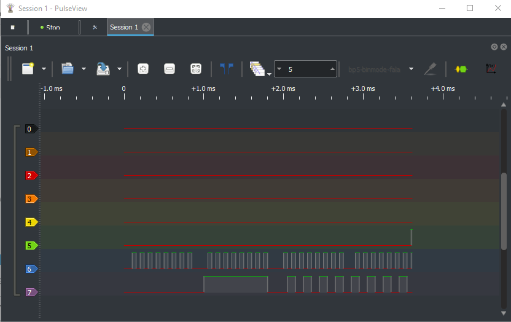
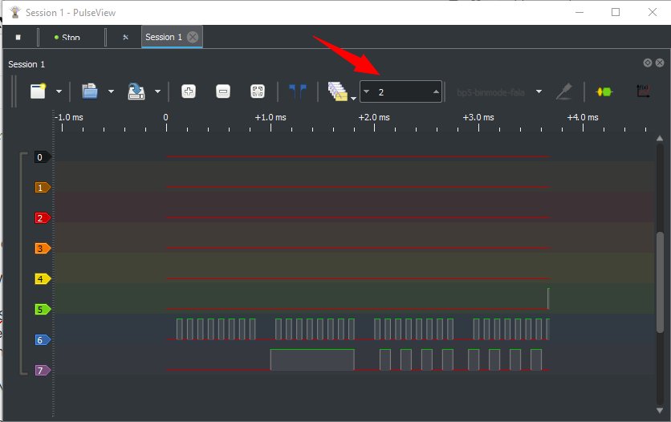
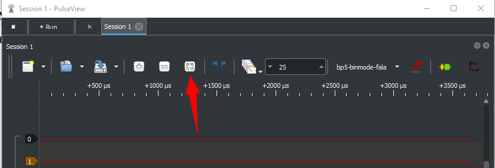

+++
weight = 15
title = 'PulseView (Follow Along)'
+++


# PulseView with Follow Along Interface



FALA is a "live action" logic analyzer mode that automatically captures everything that happens when you send commands from the Bus Pirate. It eliminates the need to setup triggers and arm a second tool for debugging.  We like to call it FALA for short.

- [PulseView with FALA mode](https://github.com/DangerousPrototypes/BusPirate5-firmware/releases/tag/custom) (Windows)

Currently FALA support is only available in a special patched version of PulseView for Windows.

{}
All Bus Pirate hardware supports follow along logic analyzer, however only Bus Pirate 6 has a second buffer to capture pins directly. In earlier hardware **all output pins are measured behind the IO buffer**. This means the logic capture may not match the actual output of the IO buffer. **This is not a problem when the Bus Pirate is used as a logic analyzer only and all pins are inputs**.
{}

## Capabilities

- 62.5MSPS (or more if overclocked)
- 131K samples
- 8 channels
- Trigger: single pin, high or low
- Follow along logic analyzer mode
- Base pin can be set to an internal pin for debugging the Bus Pirate itself

## Enable FALA Interface

{}
<span style="color:#96cb59">HiZ></span> binmode

<span className="bp-info">Select binary mode</span>
 1. SUMP logic analyzer
 2. Binmode test framework
 3. Arduino CH32V003 SWIO
 4. Follow along logic analyzer
 x. <span className="bp-info">Exit</span>
<span style="color:#96cb59"> ></span> 4
<span className="bp-info">Binmode selected:</span> Follow along logic analyzer

<span style="color:#96cb59">HiZ></span> 
{}

Enable the FALA binary interface with the ```binmode``` command. This will configure the logic analyzer and send capture notifications to the Bus Pirate's second serial port.
- Type ```binmode``` in the terminal
- Select "Follow along lgic analyzer"


## Configure PulseView


Click "connect to device" and configure PulseView for the Bus Pirate FALA mode.

- Select the ```BP5 + binmode-FALA``` driver
- Select ```serial port``` and choose the Bus Pirate serial port that is **not** used for the terminal (lower number for me these days)
- Click ```Scan for devices```
- Hopefully the Bus Pirate is detected. Click OK.

### Run Capture on PulseView


Click "run" to start capturing.

## Capture Samples

{}
<span style="color:#96cb59">HiZ></span> m

<span className="bp-info">Mode selection</span>
 1. <span className="bp-info">HiZ</span>
...
 6. <span className="bp-info">SPI</span>
...
 x. <span className="bp-info">Exit</span>
<span style="color:#96cb59">Mode ></span> 6

<span className="bp-info">Use previous settings?</span>
 <span className="bp-info">SPI speed:</span> 10 kHz
 <span className="bp-info">Data bits:</span> 8
 <span className="bp-info">Clock polarity:</span> Idle LOW
 <span className="bp-info">Clock phase:</span> LEADING edge
 <span className="bp-info">Chip select:</span> Active LOW (/CS)

<span style="color:#96cb59">y/n, x to exit (Y) ></span> y

{}

Enter a Bus Pirate mode. For now, SPI is best for testing.
- ```m``` to enter a mode, I suggest SPI

### Auto Capture Speed
{}
<span className="bp-info">Actual speed:</span> 10kHz
<span className="bp-info">Logic analyzer speed:</span> 80000Hz (8x oversampling)
<span className="bp-info">Use the 'logic' command to change capture settings</span>

<span className="bp-info">Mode:</span> SPI
<span style="color:#96cb59">SPI></span> 
{}

When changing protocol modes with the ```m``` command, FALA will automatically set the capture speed to oversample the bus speed by a factor of 8. 

### Write Data


{}
<span style="color:#96cb59">SPI></span> W 5
<span className="bp-float">5.00</span>V<span className="bp-info"> requested, closest value: <span className="bp-float">5.00</span></span>V
<span className="bp-info">Current limit:</span>Disabled

<span className="bp-info">Power supply:</span>Enabled
<span className="bp-info">Vreg output: <span className="bp-float">5.0</span></span>V<span className="bp-info">, Vref/Vout pin: <span className="bp-float">5.0</span></span>V<span className="bp-info">, Current: <span className="bp-float">3.2</span></span>mA<span className="bp-info">
</span>
<span style="color:#96cb59">SPI></span> [0x00 0xff 0x55 0xaa]

CS Enabled
<span className="bp-info">TX:</span> 0x<span className="bp-float">00</span> 0x<span className="bp-float">FF</span> 0x<span className="bp-float">55</span> 0x<span className="bp-float">AA</span> 
CS Disabled

<span className="bp-info">Logic analyzer:</span> 288 samples captured
<span style="color:#96cb59">SPI></span> 
{}

Every time you send data to the bus, the logic analyzer will capture samples. Enable the power supply and write some data.
- ```W 5``` to enable a 5volt power supply
- ```[0x00 0xff 0x55 0xaa]``` write some data to the bus
- ```Logic analyzer: 288 samples captured``` indicates how many samples were captured by the logic analyzer

### Live Logic View!



The samples are loaded into PulseView every time something happens on the bus.
- You may need to zoom a lot if there are only a few samples
- The box with a 2 (red arrow) indicates the number of captures. Up and down arrows scroll through the capture history



Autozoom fits all samples in the logic graph (red arrow).

## Change Capture Speed
{}
<span style="color:#96cb59">SPI></span> logic -o 16
Oversample rate set to: 16

Logic Analyzer settings
 Oversample rate: 16
 Sample frequency: 10000Hz

Note: oversample rate is not 1
Actual sample frequency: 160000Hz (16 * 10000Hz)

<span style="color:#96cb59">SPI></span> 
{}

The base capture speed or the oversample rate can can be changed with the ```logic``` command. Changing the oversample rate with the ```-o``` flag is probably easiest as the Bus Pirate will calculate the new sample frequency for you.

## Limitations

This is Windows only for now. The FALA mode is not supported in the official PulseView release.

Only a few modes have been updated to work with FALA. Some modes have internal buffers that cause the logic capture to end early or even return no samples. Each mode needs a new function to indicate when all bus activity is done. 

All Bus Pirate hardware supports the follow along logic analyzer, however only Bus Pirate 6 has a second buffer for the follow along mode. In earlier hardware **all output pins are measured behind the IO buffer**. This means the logic capture may not match the actual output of the IO buffer. **This is not a problem when the Bus Pirate is used as a logic analyzer only and all pins are inputs**.

## Logic Analyzer System


{}
The ```logic``` command and the [follow along binmode interface](/logic-analyzer/pulseview-fala) can be run at the same time. However, the capture buffer is shared with [SUMP logic analyzer mode](/logic-analyzer/pulseview-sump). SUMP and follow along logic analyzer modes cannot be used at the same time and will result in a memory error warning.
{}

## FALA Protocol

- [FALA protocol documentation](/binmode-reference/protocol-faladata)
