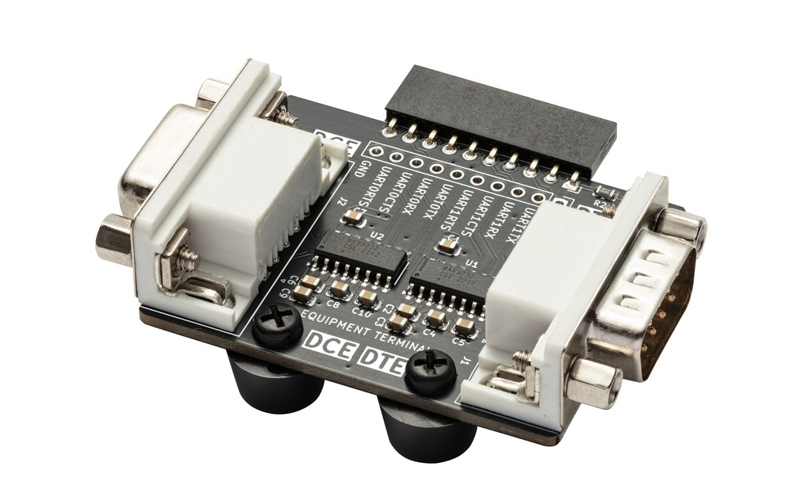
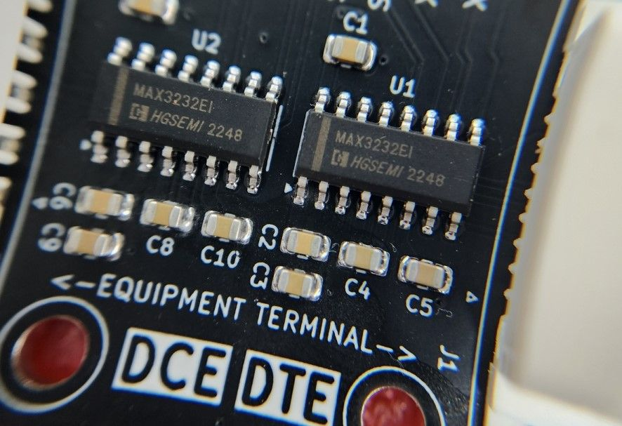
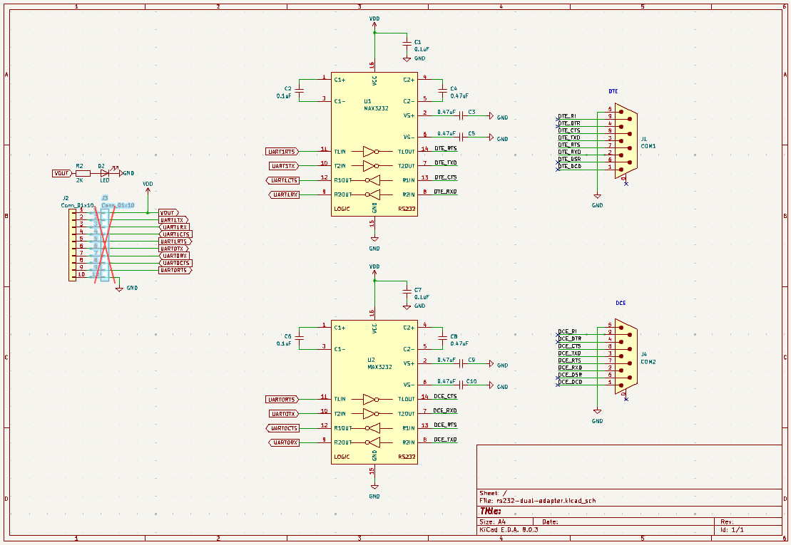

+++
weight = 43
title = 'Dual RS 232 Adapter'
+++

# Dual RS-232 Adapter



Serial ports are old tech, but old tech is meant to be hacked. Here's an adapter that handy to have around if you work with vintage hardware or industrial equipment. We'll also sift through some common serial port accessories that can save the day when you're in a pinch.

Dual RS-232 adapter for the Bus Pirate with male (Data Terminal Equipment) and female (Data Communications Equipment) connectors. This adapter allows the Bus Pirate UART (0-5volts) to communicate with true RS-232 devices (generally +/-13volts).

Microcontrollers typically have a TTL serial UART where a 0 is represented by 0 volts and a 1 is represented by 3.3volts or 5volts. RS-232 uses a different voltage range, a 0 is represented by +3 to +15volts and a 1 is represented by -3 to -15volts. The Bus Pirate can't directly communicate with RS-232 devices because it's voltage range is too low. This adapter converts the Bus Pirate UART to RS-232 voltage levels.

{}
Dual RS-232 Adapter is "in development". If hardware is available it has passed  basic functionality tests, but there isn't full documentation or support just yet. At this stage, it's best suited for developers who are comfortable with hardware and firmware development. Or for those who want to follow along.
{}


{}

## DTE and DCE connectors

| Signal | DTE pin | DCE pin | Description |
|--------|---------|---------|-------------|
| TX     | 2       | 3       | Transmit data|
| RX     | 3       | 2       | Receive data|
| RTS    | 7       | 8       | Request to send|
| CTS    | 8       | 7       | Clear to send|
| GND    | 5       | 5       | Signal ground|

The adapter has two connectors, male for DTE (Data Terminal Equipment) and female for DCE (Data Communications Equipment). The DTE connector is typically used on a computer or terminal, and the DCE connector is typically used on a modem or other device. The adapter level-shifts 4 UART signals: TX, RX, RTS and CTS. The Bus Pirate UART supports hardware flow control using the RTS and CTS pins.

## Transceiver IC



|Plank | Transceiver Chip | 
|--- | -|
|Dual RS232 "**Deluxe**" | Maxim/ADI MAX3232CSE+ |  
|Dual RS232 "**Basic**" | HGSemi MAX3232EIM | 

Genuine Maxim/ADI MAX3232CSE+ transceiver ICs are expensive. This is old tech so there's plenty of cheaper drop in replacements that will work just as well 99.9% of the time. 

With this adapter board we're trying a little experiment. The **HQ** version has a Maxim/ADI MAX3232CSE+ chip. The **Budget** version has a HGSemi MAX3232EIM chip. Both versions are functionally identical, but the **HQ** version uses more expensive components. 

What are the pros and cons of using the "off brand" part?

### Cons
- The "off brand" part may not meet the same specifications as the Maxim part
- In volume production the "off brand" part could potentially have a higher failure rate or more corner case issues
- It may be harder to source the "off brand" part in the future or outside of China

### Pros
- Counter intuitively, the "off brand" part may have better specs than the Maxim part. The Maxim part has been around for ages, and as old tech it's unlikely they've updated the design in decades. The "off brand" part could be a more modern design fabricated with newer processes and materials
- The "off brand" part is much cheaper, which makes small niche projects more doable. Consider small volume production: for 100 adapter boards we need 200 ICs. The Maxim part is $1.50 each, so $300 for the ICs alone. The "off brand" part is $0.30 each, so $60 for the ICs. That's a lot less up front investment and inventory to carry for a niche project that may only sell a few pieces.

## Serial Port Accessories

|Type|Connector 0|Connector 1|Wiring|
|-|-|-|-|
|Straight through cable|Male|Female|1:1
|Crossover cable|Female|Female|RX/TX, CTS/RTS, DTR/DSR swapped
|M:M Gender changer|Male|Male|1:1|-|-|
|F:F Gender changer|Female|Female|1:1|-|-|
|F:F crossover adapter|Female|Female|RX/TX, CTS/RTS, DTR/DSR swapped, DTR...|-|-|
|Female  breakout|Female|Screw terminal|-|-|-|
|Male breakout|Male|Screw terminal|-|-|-|

The adapter is designed with the most common serial port pinout, but there are endless permutations out there. Hobby projects and industrial tools, where serial ports were common until very recently, are notorious for funky pinouts. 

Let's see what cheap and useful serial port accessories are available in the market.

### Straight Through Cable

The most common serial cable. Connects a male (usually PC/terminal/DTE) to female (usually equipment/DCE). Straight through 1 to 1 wiring.

{}
Use this cable to connect the adapter DTE and DCE ports. Then use the ```monitor``` command in UART mode to test data transmission and flow control.
{}

### Crossover Cable


Also called a null modem cable. Connects two male (usually PC/terminal/DTE) ports. 

|Signal 0| Pin 0|Direction| Pin 1|Signal 1|
|-|-|-|-|-|
|DCD|1|\<->|1|DCD|
|RX|2|\<-|3|TX|
|TX|3|->|2|RX|
|DTR|4|->|6|DSR|
|GND|5|-|5|GND|
|DSR|6|\<-|4|DTR|
|RTS|7|->|8|CTS|
|CTS|8|\<-|7|RTS|
|RI|9|\<->|9|RI|

RX/TX, CTS/RTS, DTR/DSR are swapped so that two normally master devices can communicate. 

{}
Using a null modem cable you can connect the serial ports of two PCs, open a terminal on each, and chat between them.
{}

### Gender Changer Adapters

Female to female, and male to male gender changers. Used with a common cable to interface odd devices, or with odd cables to save the day.

### Male Cross Over Adapter

Turns a common straight through cable into a null modem cable that connects two normally master (PC/terminal/DTE) devices. 

|Signal 0| Pin 0|Direction| Pin 1|Signal 1|
|-|-|-|-|-|
|RX|2|\<-|3|TX|
|TX|3|->|2|RX|
|DTR|4|->|6&1|DSR/DCD|
|GND|5|-|5|GND|
|DSR/DCD|6&1|\<-|4|DTR|
|RTS|7|->|8|CTS|
|CTS|8|\<-|7|RTS|
|RI|9|removed|9|RI|

RX/TX, CTS/RTS and DSR/DTR are swapped. Swapped, but in this case DSR and DCD are connected together. This is a common hack for old equipment that ....

### Breakouts
 

Breakout male and female connectors to screw terminals. Super handy to have, inexpensive and useful for hacking.

## Schematic



Dual RS-232 adapter [schematic and PCB](https://github.com/DangerousPrototypes/BusPirate5-hardware/tree/main/) are available in the Bus Pirate 5 hardware repository.

## BOM

| Item | Quantity | Reference | Value | Package |
|------|----------|-----------|-------|---------|
| 1 | 4 | C1, C2, C6, C7 | 0.1uF | Capacitor_SMD:C_0805_2012Metric |
| 2 | 6 | C3, C4, C5, C8, C9, C10 | 0.47uF | Capacitor_SMD:C_0805_2012Metric |
| 3 | 1 | D2 | LED | LED_SMD:LED_0805_2012Metric |
| 4 | 1 | J1 | COM1 | Connector_Dsub:DSUB-9_Male_Horizontal|
| 6 | 1 | J3 | Conn_01x10 | Connector_PinHeader_2.54mm:PinHeader_1x10_P2.54mm_Vertical |
| 7 | 1 | J4 | COM2 | Connector_Dsub:DSUB-9_Female_Horizontal |
| 8 | 1 | R2 | 2K | Resistor_SMD:R_0805_2012Metric |
| 9 | 2 | U1, U2 | MAX3232 | Package_SO:SOP-16_3.9x9.9mm_P1.27mm |

## Resources

- Dual RS-232 adapter [schematic and PCB](https://github.com/DangerousPrototypes/BusPirate5-hardware/tree/main/)
- [UART mode documentation](/command-reference/uart-protocol)
- [Development thread](https://forum.buspirate.com/t/dual-rs232-db9-adapter-plank/484)
0
## Get a Bus Pirate


{}

### Community


{}

### Documentation
import FooterDocs from '../../_common/_footer/_footer-docs.md' 

{}


