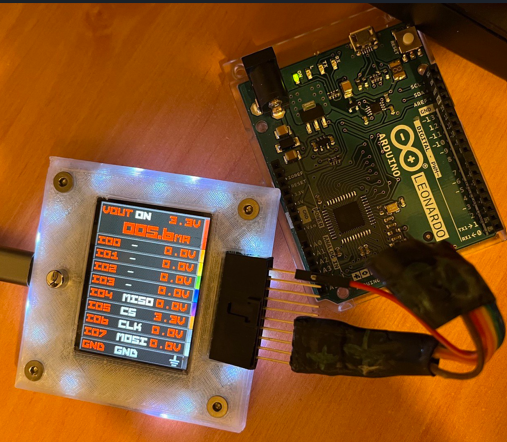
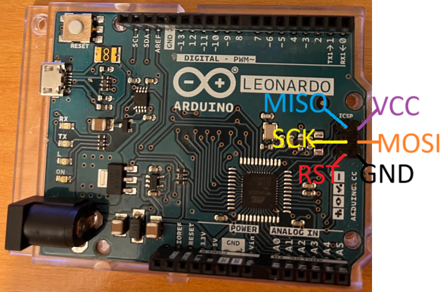
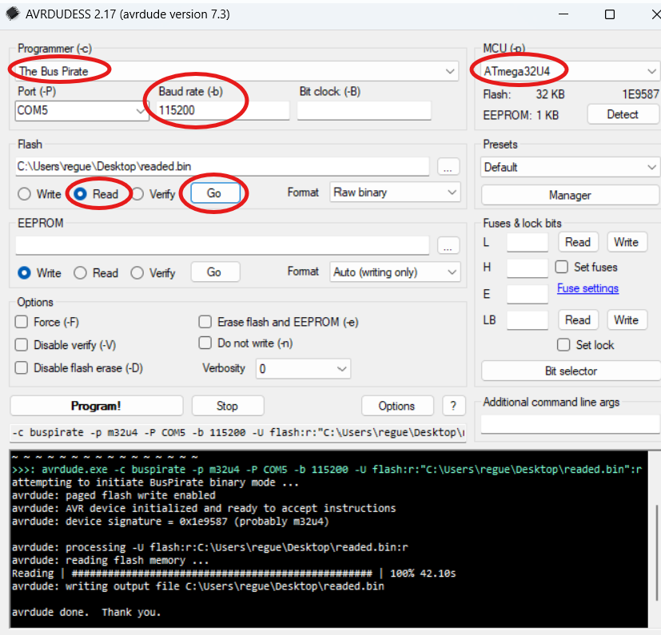

+++
weight = 101
title = 'AVRDUDE Programmer'
+++


# AVRDUDE Programmer



The Bus Pirate can serve as a programmer and dumper for AVR chips, using the command-line utility AVRDUDE. 

- [AVRDUDE command line programmer](https://github.com/avrdudes/avrdude)
- [AVRDUDESS graphical user interface](https://github.com/ZakKemble/AVRDUDESS)

For those who prefer a graphical user interface, AVRDUDESS offers a user-friendly front-end for AVRDUDE. Both tools together provide a powerful setup for working with AVR chips.

In this demo we'll program the ATmega32U4 chip found on the Arduino Leonardo through the ICSP header. 


## Connections



|Bus Pirate|Arduino Leonardo|Description|
|-|-|-|
|MISO|ICSP-1|Master In Slave Out|
|VOUT|ICSP-2|Power Supply (5 volts)|
|CLK|ICSP-3|Clock|
|MOSI|ICSP-4|Master Out Slave In|
|CS|ICSP-5(RST/RESET)|Chip Select|
|GND|ICSP-6|Ground|

Connect the Bus Pirate to the ICSP header according to the table above.

{}
RESET is connected to the CS pin on the Bus Pirate. The CS pin is used to reset the AVR chip.
{}

## Setup
{}
<span style="color:#96cb59">HiZ></span> binmode

<span style="color:#bfa530">Select binary mode</span>
 1. SUMP logic analyzer
 2. Binmode test framework
 3. Arduino CH32V003 SWIO
 4. Follow along logic analyzer
 5. Legacy Binary Mode for Flashrom and AVRdude (EXPERIMENTAL)
 x. Exit
<span style="color:#96cb59"> ></span> 5
<span style="color:#bfa530">Binmode selected: </span>
 Legacy Binary Mode for Flashrom and AVRdude (EXPERIMENTAL)
<span style="color:#bfa530">Binmode active. Terminal locked</span>
{}

In the Bus Pirate terminal use the ```binmode``` command to select the "Legacy Binary Mode for Flashrom and AVRdude".

{} 
This mode is experimental, use at your own risk.
{}

{}
<span style="color:#bfa530">Power supply
Volts (0.80V-5.00V)</span>
<span style="color:#96cb59">x to exit (3.30) ></span> 5
<span className="bp-float">5.00</span>V<span style="color:#bfa530"> requested, closest value: <span className="bp-float">5.00</span></span>V
Set current limit?
y

<span style="color:#bfa530">Maximum current (0mA-500mA)</span>
<span style="color:#96cb59">x to exit (100.00) ></span> 150
<span className="bp-float">150.0</span>mA<span style="color:#bfa530"> requested, closest value: <span className="bp-float">150.0</span></span>mA

<span style="color:#bfa530">Power supply:</span>Enabled
<span style="color:#bfa530">
Vreg output: <span className="bp-float">4.9</span></span>V<span style="color:#bfa530">, Vref/Vout pin: <span className="bp-float">4.9</span></span>V<span style="color:#bfa530">, Current sense: <span className="bp-float">9.2</span></span>mA<span style="color:#bfa530">
</span>
{}

When entering this mode, it asks for the power supply voltage. Select 5 volts. It also asks for the current limit. 150 mA is a good value for the current limit.

The terminal is locked in this mode. To exit, re-plug the Bus Pirate.

{} 
Arduino Leonardo runs at 5 volts. Make sure the Bus Pirate power supply is set to 5 volts.
{}

## Dumping Flash memory

### Command Line

```bash
avrdude -c buspirate -P COM5 -p m32u4 -U flash:r:dump.bin:r
```
This command uses avrdude to read the flash memory of the ATmega32U4 and saves it to a file named `dump.bin`.

- The correct COM/serial port is the Bus Pirate binary interface, this **is not the same** as the terminal serial port used to enter binmode.
- For Linux, the serial port usually starts with `/dev/ttyUSB`

```bash
attempting to initiate BusPirate binary mode ...
avrdude: paged flash write enabled
avrdude: AVR device initialized and ready to accept instructions
avrdude: device signature = 0x1e9587 (probably m32u4)

avrdude: processing -U flash:r:dump.bin:r
avrdude: reading flash memory ...
Reading | ################################################## | 100% 42.14 s
avrdude: writing output file dump.bin

avrdude done.  Thank you.
```
### AVRDUDESS



Using AVRDUDESS is easy and straightforward. Just select:

- "The Bus Pirate" as the programmer
- ATmega32U4 as the target (MCU)
- Port COM (the port where the Bus Pirate binmode is connected)
- Baud rate: 115200

Select "Read" and click "Go" button to dump the flash memory.

{} 
Never select "The Bus Pirate bitbang interface, supports TPI" as the programmer. It will not work.
{}


