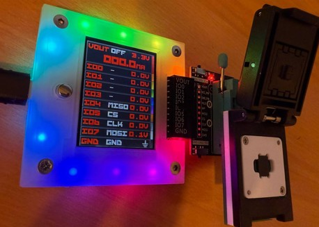
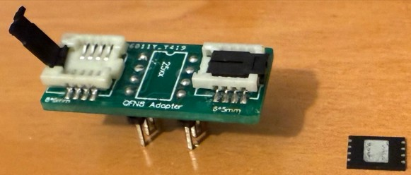
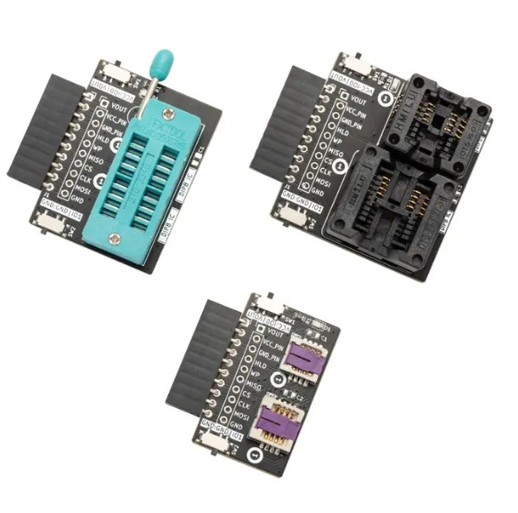

+++
weight = 102
title = 'Flashrom'
+++


# Flashrom



The Bus Pirate can serve as a programmer and dumper for flash memory chips, using the command-line utility Flashrom.

Flashrom is a versatile utility for identifying, reading, writing, verifying, and erasing flash chips on a wide range of devices—including mainboards, controller cards, and various programmer modules. It supports hundreds of flash chips, chipsets, and boards.

- [Flashrom project page](https://flashrom.org/)

In this demo we'll dump the W25Q64JV-.Q (WSON8 6x8) chip: 64Mb Serial Flash memory with uniform 4KB sectors, Dual/Quad SPI (4 I/O), 2.7-3.6V supply, up to 133MHz.

## Connections

|Bus Pirate|W25Q64JV-.Q|Description|
|-|-|-|
|MISO|DO|Master In Slave Out|
|VOUT|VCC|Power Supply (3v3 volts)|
|CLK|CLK|Clock|
|MOSI|DI|Master Out Slave In|
|CS|CS|Chip Select|
|GND|GND|Ground|

I am using a (WSON8 6x8)-to-DIP adapter to connect the Bus Pirate to the W25Q64JV-.Q chip.

This adapter matches the same pinout order as the ZIF SOCKET module on the Bus Pirate.

Simply insert the adapter into the ZIF SOCKET module and seat the W25Q64JV-.Q chip onto the adapter.

{}
You can use an inexpensive WSON8 6x8 to DIP adapter to connect the Bus Pirate to the W25Q64JV-.Q chip, or simply use the Bus Pirate's plank with the socket already soldered.
{}

Some inexpensive adapters, like this QFN8 6X8 to DIP: 



May not make proper contact and might require extra pressure to work correctly with the chip. You can use these adapters by connecting the Bus Pirate cables to the male header, or if you have the Bus Pirate’s ZIF plank, connect it directly there, and it should work out of the box.

These official planks work seamlessly with the Bus Pirate:



Just push the chip into the socket and connect the Bus Pirate to the computer.

## Setup
{}
<span className="bp-prompt">HiZ></span> binmode

<span className="bp-info">Select binary mode</span>
 1. SUMP logic analyzer
 2. Binmode test framework
 3. Arduino CH32V003 SWIO
 4. Follow along logic analyzer
 5. Legacy Binary Mode for Flashrom and AVRdude (EXPERIMENTAL)
 x. Exit
<span className="bp-prompt"> ></span> 5
<span className="bp-info">Binmode selected: </span>
 Legacy Binary Mode for Flashrom and AVRdude (EXPERIMENTAL)
<span className="bp-info">Binmode active. Terminal locked</span>
{}

In the Bus Pirate terminal use the ```binmode``` command to select the "Legacy Binary Mode for Flashrom and AVRdude".

{} 
This mode is experimental, use at your own risk.
{}

{}
<span className="bp-info">Power supply
Volts (0.80V-5.00V)</span>
<span className="bp-prompt">x to exit (3.30) ></span> 3.30
<span className="bp-float">3.30</span>V<span className="bp-info"> requested, closest value: <span className="bp-float">3.30</span></span>V
Set current limit?
y

<span className="bp-info">Maximum current (0mA-500mA)</span>
<span className="bp-prompt">x to exit (100.00) ></span> 150
<span className="bp-float">150.0</span>mA<span className="bp-info"> requested, closest value: <span className="bp-float">150.0</span></span>mA

<span className="bp-info">Power supply:</span>Enabled
<span className="bp-info">
Vreg output: <span className="bp-float">3.30</span></span>V<span className="bp-info">, Vref/Vout pin: <span className="bp-float">3.30</span></span>V<span className="bp-info">, Current sense: <span className="bp-float">9.2</span></span>mA<span className="bp-info">
</span>
{}

When entering this mode, it asks for the power supply voltage. Select 3.30 volts. It also asks for the current limit. 150 mA is a good value for the current limit.

The terminal is locked in this mode. To exit, re-plug the Bus Pirate.

{} 
Max voltage for the W25Q64JV-.Q is 3.6 volts. Make sure the Bus Pirate power supply is set to 3.30 volts.
{}

## Dumping Flash memory

### Command Line

```bash
flashrom.exe --progress -V -c "W25Q64JV-.Q" -p buspirate_spi:dev=COM54,serialspeed=115200,spispeed=1M -r flash_content.bin
```
This command uses flashrom to read the flash memory of the W25Q64JV-.Q and saves it to a file named `flash_content.bin`.

{}
- serialspeed: Sets the baud rate of the terminal serial port. This value must be 115200.
- spispeed: Specifies the speed of the SPI interface; 1M denotes 1MHz.
- dev: Indicates the COM/serial port used by the Bus Pirate. Verify the correct port in the Windows Device Manager.
{}

- The correct COM/serial port is the Bus Pirate binary interface, this **is not the same** as the terminal serial port used to enter binmode.
- For Linux, the serial port usually starts with `/dev/ttyUSB`

```bash
flashrom 1.4.0-devel on Windows 10.0 (x86_64) Dreg's compilation
flashrom is free software, get the source code at https://flashrom.org
Command line (8 args): flashrom.exe --progress -V -c W25Q64JV-.Q -p buspirate_spi:dev=COM54,serialspeed=115200,spispeed=1M -r flash_content.bin
Initializing buspirate_spi programmer
Baud rate is 115200.
Detected Bus Pirate hardware 2.5
Detected Bus Pirate firmware 7.1
Using SPI command set v2.
SPI speed is 1MHz
Raw bitbang mode version 1
Raw SPI mode version 1
Driving AUX high.
The following protocols are supported: SPI.
Probing for Winbond W25Q64JV-.Q, 8192 kB: compare_id: id1 0xef, id2 0x4017
Added layout entry 00000000 - 007fffff named complete flash
Found Winbond flash chip "W25Q64JV-.Q" (8192 kB, SPI) on buspirate_spi.
Chip status register is 0x00.
This chip may contain one-time programmable memory. flashrom cannot read
and may never be able to write it, hence it may not be able to completely
clone the contents of this chip (see man page for details).
===
This flash part has status UNTESTED for operations: WP
The test status of this chip may have been updated in the latest development
version of flashrom. If you are running the latest development version,
please email a report to flashrom@flashrom.org if any of the above operations
work correctly for you with this flash chip. Please include the flashrom log
file for all operations you tested (see the man page for details), and mention
which mainboard or programmer you tested in the subject line.
Thanks for your help!
Skipping writeprotect-based unlocking for read/verify operations.
Reading flash... read_flash:  region (00000000..0x7fffff) is readable, reading range (00000000..0x7fffff).
[READ] 0% complete... [READ] 1% complete... [READ] 2% complete... [READ] 3% complete...
...
```

At the end of the process, flashrom will save the content of the flash memory to a file named `flash_content.bin`.

{} 
- The baud rate is fixed at 115200 and cannot be changed, simulating Bus Pirate hardware 2.5 which defaults to this value.
- Voltage and current limits must be configured via the Bus Pirate terminal.
- This is an experimental version and may not work in all cases.
{}