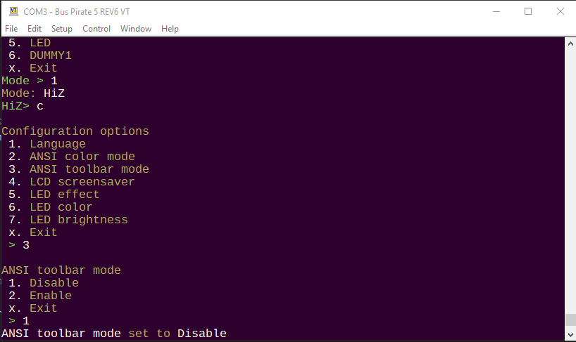
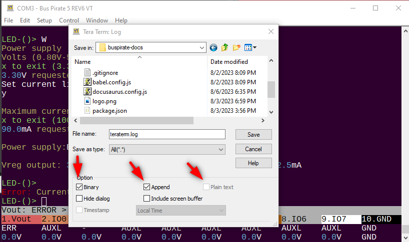
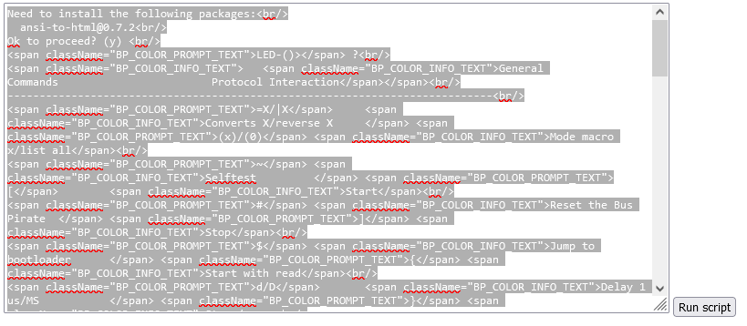

+++
weight = 5
title = 'Documentation'
+++


# Writing Documentation

To avoid using screenshots, which have variable quality and aren't screen reader friendly, most of the Bus Pirate terminal output is shown as actual text inside a React component tag. This page describes how to capture, convert and export terminal output for use in this documentation.

## Disable the Bus Pirate toolbar



The screen redraw activity form the Bus Pirate toolbar will make a mess in the output. Open [Tera Term](https://ttssh2.osdn.jp/index.html.en) and disable the toolbar before logging.

* From the Bus Pirate command prompt choose ```c``` for the configuration menu. 
* Choose ```ANSI toolbar mode``` and ```Disable```.

## Capture Terminal Output


* In Tera Term select ```File```>```Log...```.



* Under options select ```Binary``` and ```Append```. 
* Unselect ```Plain text``` if it is not automatically disabled. 
* Click ```Save```, then perform the Bus Pirate tasks you want to record.

## Convert VT100 to HTML

Install [ansi-to-html](https://www.npmjs.com/package/ansi-to-html).

```
npx ansi-to-html teraterm.log > test.html
```

Convert the Tera Term .log file to html from an OS command prompt using this command.

## Convert HTML tags for use in docs



The final conversion step simply replaces the ansi-to-html color codes with our custom Bus Pirate terminal html color classes, and does a few other escape things to make the output play well with Docusaurus.

* Open [clean.html](pathname:///clean.html) in a web browser. 
* Open the log output (test.html) in a text editor. 
* Paste the contents of test.html into the box in the web browser.
* Click ```Run Script```.

Copy the processed output from the browser box. It's ready to add to the documentation.

## Paste the output in docs

{}
<span className="BP_COLOR_PROMPT_TEXT">LED-()></span> m<br/>
<span className="BP_COLOR_INFO_TEXT"><br/>
<span className="BP_COLOR_INFO_TEXT">Mode selection</span></span><br/>
 1. <span className="BP_COLOR_INFO_TEXT">HiZ</span><br/>
 2. <span className="BP_COLOR_INFO_TEXT">UART</span><br/>
 3. <span className="BP_COLOR_INFO_TEXT">I2C</span><br/>
 4. <span className="BP_COLOR_INFO_TEXT">SPI</span><br/>
 5. <span className="BP_COLOR_INFO_TEXT">LED</span><br/>
 6. <span className="BP_COLOR_INFO_TEXT">DUMMY1</span><br/>
 x. <span className="BP_COLOR_INFO_TEXT">Exit</span><br/>
<span className="BP_COLOR_PROMPT_TEXT">Mode ></span> 1<br/>
<span className="BP_COLOR_INFO_TEXT">Mode:</span> HiZ<br/>
<span className="BP_COLOR_PROMPT_TEXT">HiZ></span>
{}

Paste the output into a markdown file, the extension ***must*** be ```.mdx```. 

```

```
Import the BrowserWindow component using this code on the first line below the front mater.

Wrap the terminal output in ```{}``` ```{}``` tags.

{}
The ```{}``` React component only works in pages with ```.mdx``` extension.
{}

## Resources

### Files
import FooterFiles from '/_common/_footer/_footer-files.md'

<FooterFiles/>

### Community
import FooterCommunity from '/_common/_footer/_footer-community.md'

<FooterCommunity/>
